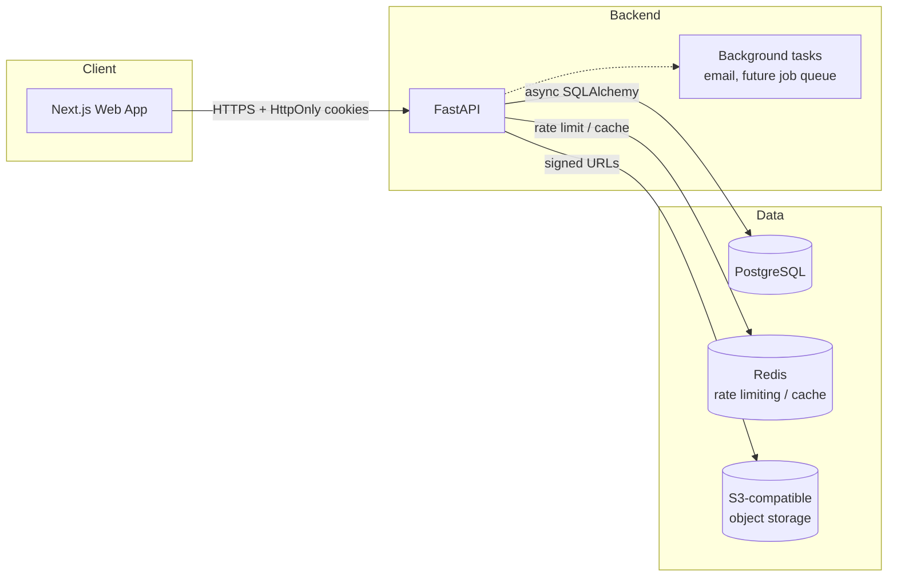
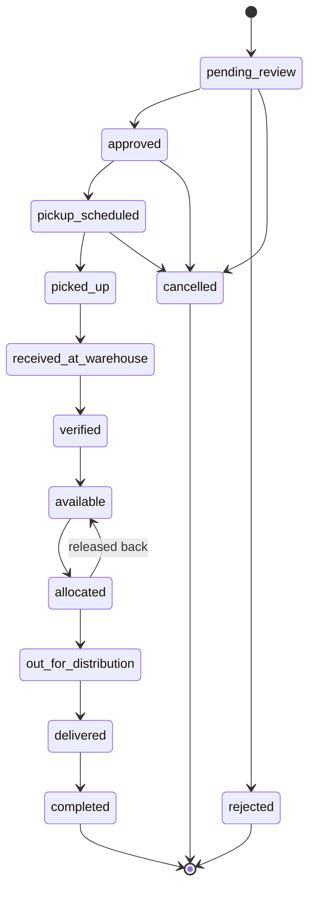
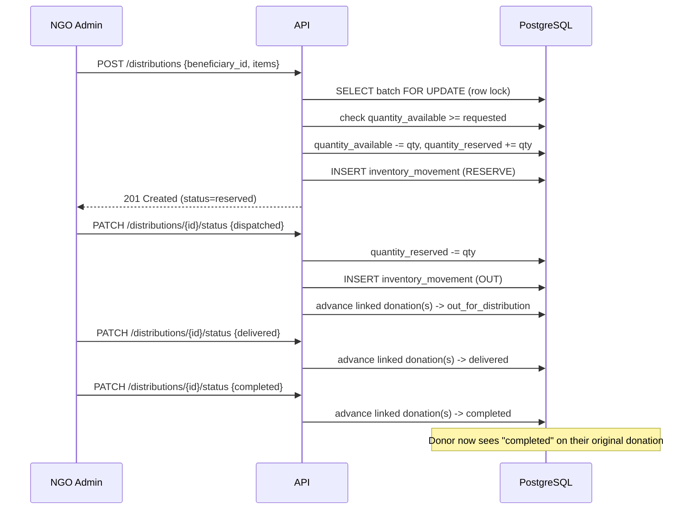
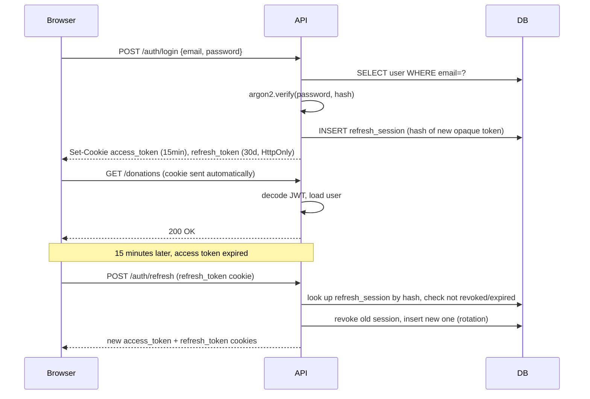
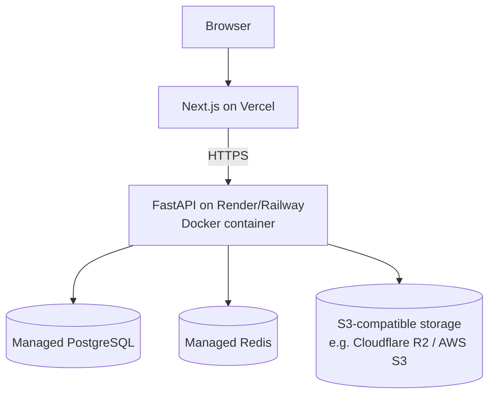

# Architecture

## System overview

## Donation lifecycle

This state machine is enforced in code (`app/donations/models.py::ALLOWED_DONATION_TRANSITIONS`), not just documented — any request for an invalid transition returns `409 Conflict`.

## Distribution / inventory flow

Row-level locking (`SELECT ... FOR UPDATE`) around every quantity mutation is what prevents two concurrent distributions from double-allocating the same stock (requirement: "prevent negative inventory").

## Authentication flow

## Deployment architecture (production target)

## Why these technology choices

- **FastAPI over Django/Flask**: native async support matters for an I/O-bound app (many DB round-trips per request in the distribution flow), and Pydantic-based request/response validation removes an entire class of input-handling bugs for free.
- **SQLAlchemy 2.x async + explicit service layer**: keeps route handlers thin (HTTP concerns only) and business logic (state machines, stock locking) testable in isolation from FastAPI.
- **JWT access + opaque refresh, not JWT-only**: a pure-JWT refresh scheme can't be revoked before expiry. Storing only the *hash* of an opaque refresh token lets the server revoke individual sessions (logout, logout-all-devices, password-reset-triggered revocation) without needing a JWT blocklist.
- **Next.js App Router**: server components reduce client bundle size for content-heavy pages (landing, tracking); client components are used precisely where interactivity is needed (forms, dashboards).
- **Alembic over "just let SQLAlchemy create_all in prod"**: production schema changes must be reviewable, reversible, and applied without downtime-causing full resyncs.

## Known architectural gaps (see also docs/troubleshooting.md)

- Background job queue (Celery/RQ) is referenced in the requirements but not implemented — emails currently send synchronously (fine at demo scale, not at production volume).
- S3 storage abstraction is designed in config (`S3_*` env vars) but the actual upload endpoints (`/uploads`) are not yet implemented — donation photos and delivery-proof photos are modeled in the DB (`donation_media`, `delivery_proofs.photo_storage_key`) but not yet wired to a working upload route.
- NGO/Volunteer/Admin dashboard UIs are not yet built (API endpoints they'd call already exist and are tested).
