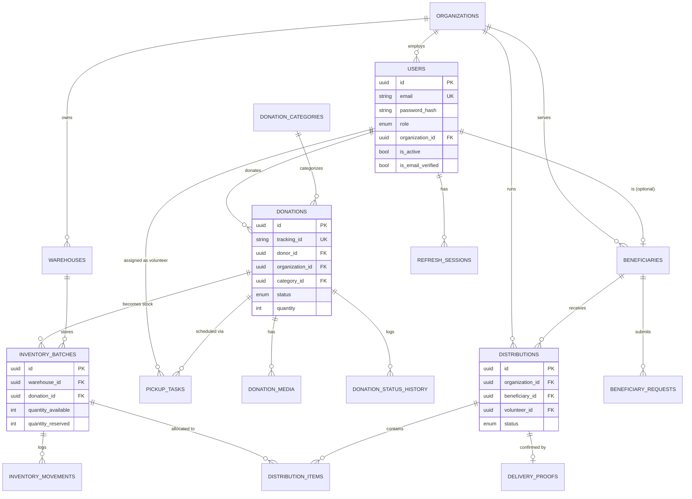

# Database

PostgreSQL, accessed via async SQLAlchemy 2.x, versioned with Alembic. UUID primary keys throughout; `created_at`/`updated_at` on every table. Soft-deletion is deliberately **not** used anywhere in this schema — every entity here (users, donations, inventory) has a legitimate terminal status (`cancelled`, `rejected`, `is_active=false`) that serves the same purpose without the query-complexity cost of remembering `WHERE deleted_at IS NULL` everywhere.

## ER Diagram



## Key design decisions

**Inventory movements are append-only.** `inventory_movements` rows are never updated or deleted — every `IN`/`RESERVE`/`RELEASE`/`OUT`/`ADJUSTMENT` is a new row referencing the batch. `quantity_available` and `quantity_reserved` on `inventory_batches` are denormalized running totals kept in sync by the service layer inside a single transaction with `SELECT ... FOR UPDATE` row locking — this is what prevents two concurrent distribution requests from both reserving the last unit of stock.

**`donation_status_history` and `audit_logs` are also append-only**, and serve different purposes: `donation_status_history` is domain-specific (used to render the donor-facing timeline), while `audit_logs` is cross-cutting (used for security/compliance review across all resource types).

**Beneficiary `address` is excluded from the default API response schema** (`BeneficiaryOut`), even though it's a normal DB column — this is enforced at the Pydantic schema layer so it's impossible to accidentally leak it through a list endpoint.

**CHECK constraints as a backstop, not the primary defense.** `quantity_available >= 0` and `quantity_reserved >= 0` are enforced at the database level via `CheckConstraint`, in addition to the service-layer logic that should never let this happen. Defense in depth: even a bug in the Python logic can't push inventory negative.

## Migrations

```bash
cd apps/api

# Apply all pending migrations
alembic upgrade head

# Roll back one migration
alembic downgrade -1

# Generate a new migration after changing models
alembic revision --autogenerate -m "add xyz table"
```

**Note on the included initial migration** (`alembic/versions/0001_initial.py`): it was hand-authored to mirror the SQLAlchemy models exactly, because this sandbox environment could not install PostgreSQL to run `alembic revision --autogenerate` against a live database (see `docs/troubleshooting.md`). Before relying on it in production, run:

```bash
alembic upgrade head          # apply it to a real Postgres instance
alembic check                 # (Alembic 1.13+) verifies models match the DB schema
```

If `alembic check` reports drift, run `alembic revision --autogenerate -m "sync"` and review the generated diff.

## Seed data

`python -m scripts.seed` creates fictional demo data (one org, one user per role, categories, a warehouse, and one donation walked through the full lifecycle to `completed`) so the platform can be demonstrated immediately. It refuses to run when `ENV=production`. See the README for demo credentials.
